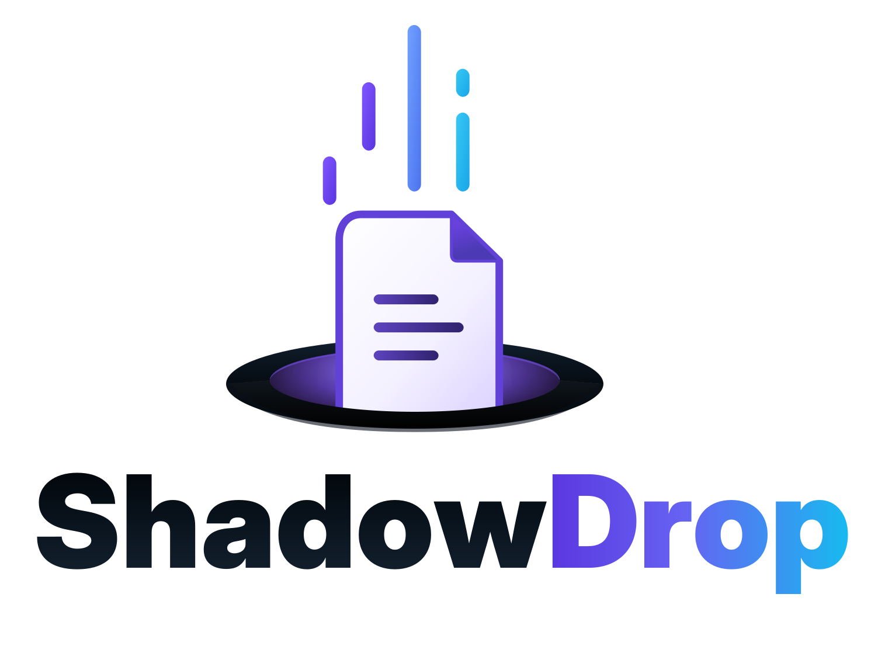

<p align="center">
  <picture>
    <source media="(prefers-color-scheme: dark)" srcset="images/sd-dark.svg" />
    
  </picture>
</p>

<p align="center">
  <a href="LICENSE"></a>
  <a href="https://github.com/chA0s-Chris/ShadowDrop/releases"></a>
  <a href="https://hub.docker.com/r/chaos/shadowdrop"></a>
</p>

ShadowDrop is a self-hosted service for secure one-off file handoffs. The CLI
encrypts files on the sender's machine (AES-256-GCM), and default CLI
downloads keep decryption on the recipient's side so the server stores and
serves only ciphertext without seeing key material. Direct-HTTP downloads trade
that property for browser/curl compatibility by sending key material to the
server for server-side decryption.

A typical handoff: an operator runs the ShadowDrop container, uploads files
with the CLI, sends the recipient the share URL, and delivers the decryption
key over a separate channel. Shares expire automatically (default: 7 days) and
can be revoked at any time.

ShadowDrop ships through two channels:

- **API server** — Docker image [`chaos/shadowdrop`](https://hub.docker.com/r/chaos/shadowdrop)
  on Docker Hub (the only image registry).
- **CLI** — single-file native binaries for Linux, macOS, and Windows from the
  [GitHub releases](https://github.com/chA0s-Chris/ShadowDrop/releases).

## Quick start: run the server

```bash
docker run -d --name shadowdrop \
  -p 19423:19423 \
  -v shadowdrop-data:/app/data \
  -e SHADOWDROP_BOOTSTRAP_ADMIN_TOKEN="use-a-long-random-secret" \
  chaos/shadowdrop:latest
```

The container listens on plain HTTP port `19423` and expects TLS to be
terminated by a reverse proxy in front of it. All state (metadata database and
encrypted blobs) lives under `/app/data` — keep it on a persistent volume.
`SHADOWDROP_BOOTSTRAP_ADMIN_TOKEN` is required on the first start and becomes
the admin bearer token; see the [deployment guide](docs/DEPLOYMENT.md) for
details, the Docker Hub tagging scheme, and reverse-proxy guidance.

Do not expose `/api/admin/*` to the public Internet without an upstream
control — read [deployment hardening](docs/DEPLOYMENT_HARDENING.md) before going live.

## Quick start: CLI

Download the binary for your platform from the
[releases page](https://github.com/chA0s-Chris/ShadowDrop/releases) (verify it
against `CHECKSUMS.sha256`) and put it on your `PATH` as `shadowdrop`:

```bash
VERSION=1.0.0
curl -LO "https://github.com/chA0s-Chris/ShadowDrop/releases/download/v${VERSION}/shadowdrop-${VERSION}-linux-x64"
install -m 755 "shadowdrop-${VERSION}-linux-x64" ~/.local/bin/shadowdrop
```

On Windows, download `shadowdrop-<version>-win-x64.exe` and copy it to a
directory on your `PATH` as `shadowdrop.exe`, e.g. in PowerShell:

```powershell
$Version = "1.0.0"
Copy-Item "shadowdrop-$Version-win-x64.exe" "$Env:LOCALAPPDATA\Microsoft\WindowsApps\shadowdrop.exe"
```

Point the CLI at your server. The upload token **is** the admin bearer token
(the bootstrap admin token from above) — uploads go through the admin API, so
anyone who can upload can also administer the server (see
[security trade-offs](docs/SECURITY_TRADEOFFS.md)):

```bash
export SHADOWDROP_SERVER_URL="https://drop.example.com"
export SHADOWDROP_UPLOAD_TOKEN="use-a-long-random-secret"
```

Upload a file — the CLI encrypts it locally and prints a share URL plus the
decryption key:

```bash
shadowdrop upload report.pdf
# share-url:https://drop.example.com/d/qHxI_3N1cTzPNkt1WSi2rieBiSi858y-OA1Sc_OQlz4
# share-key:5f4a5a7048d41e66dd2833126184beefa46ecf4e9c3c49091a1aafb2e7acfa78
```

Send the recipient the share URL, and the share key over a **different**
channel. The recipient downloads and decrypts with the CLI (the decrypted
content is written to stdout):

```bash
shadowdrop download "https://drop.example.com/d/qHxI_3N1cTzPNkt1WSi2rieBiSi858y-OA1Sc_OQlz4" \
  --share-key 5f4a5a7048d41e66dd2833126184beefa46ecf4e9c3c49091a1aafb2e7acfa78 \
  > report.pdf
```

For recipients without the CLI there is a direct-HTTP mode (`--direct-http`)
that emits a browser-compatible URL and a `curl` command — with weaker
secrecy properties. The [CLI guide](docs/CLI.md) covers all commands,
configuration sources, download queues, and credential-handling options.

## Documentation

- [Deployment guide](docs/DEPLOYMENT.md) — container deployment, `/app/data`
  persistence, Docker Hub tags, reverse-proxy TLS and public hostnames.
- [CLI guide](docs/CLI.md) — installation, configuration precedence, and
  copy-pasteable examples for every workflow.
- [Security trade-offs](docs/SECURITY_TRADEOFFS.md) — separate-key versus
  direct-HTTP shares, key-leakage channels, bearer tokens, TLS trust options.
- [Deployment hardening](docs/DEPLOYMENT_HARDENING.md) — admin endpoint
  exposure, reverse-proxy controls, direct-HTTP URL sensitivity.

## Current MVP limitations

- **Release publishing is not wired up yet.** The release workflow builds the
  release artifacts and the multi-platform Docker image, but nothing is
  published to Docker Hub or GitHub releases yet. Until the first release lands, build locally:
  `bash build.sh BuildDockerImage` for the image and
  `bash build.sh PublishCli` for the CLI.
- Release CLI binaries are named `shadowdrop-<version>-<platform>` (the same
  names `bash build.sh PublishCli` produces locally); the documented install
  step above places the binary on your `PATH` as `shadowdrop`.
- There is no separate upload-token provisioning: uploading requires the admin
  bearer token and therefore access to the admin exposure boundary.
- There is no web UI; shares are consumed via the CLI or direct HTTP.

## License

ShadowDrop is licensed under the [MIT license](LICENSE).
